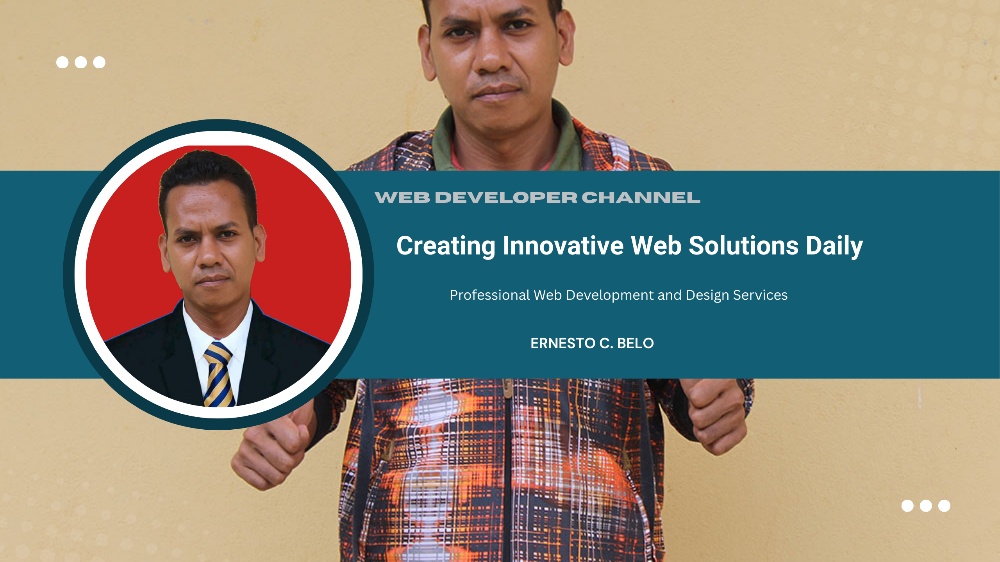

<!--
**Ernestocbelo/Ernestocbelo** is a ✨ _special_ ✨ repository because its `README.md` (this file) appears on your GitHub profile.

Here are some ideas to get you started:

- 🔭 I’m currently working on ...
- 🌱 I’m currently learning ...
- 👯 I’m looking to collaborate on ...
- 🤔 I’m looking for help with ...
- 💬 Ask me about ...
- 📫 How to reach me: ...
- 😄 Pronouns: ...
- ⚡ Fun fact: ...
-->
- 🔭 I’m currently **working** on ...
- 🌱 I’m currently learning [**laravel**](http://laravel.com) framwork
-
## Skills

#### Web Developer

#### Graphics Design

#### Artificial Intelligence

### Connect with me

   

### My Github Stats

